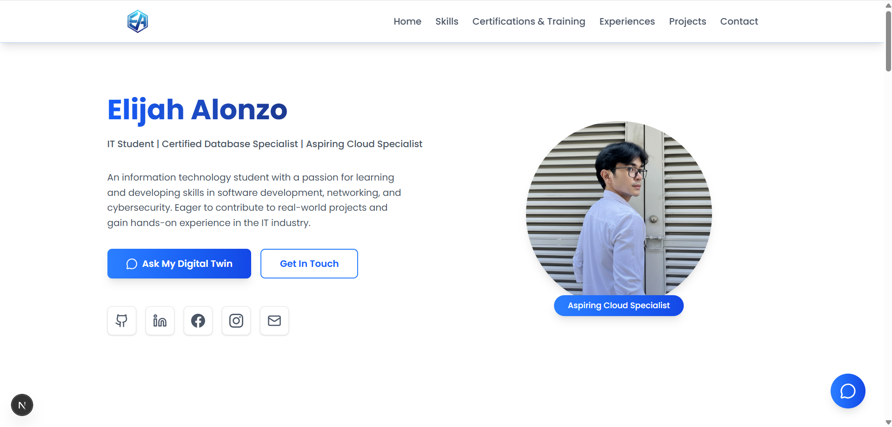
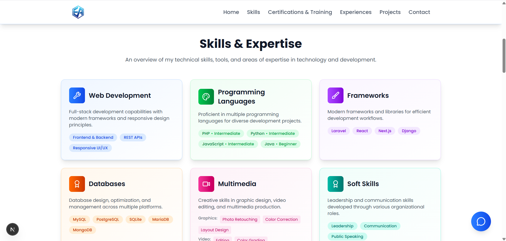
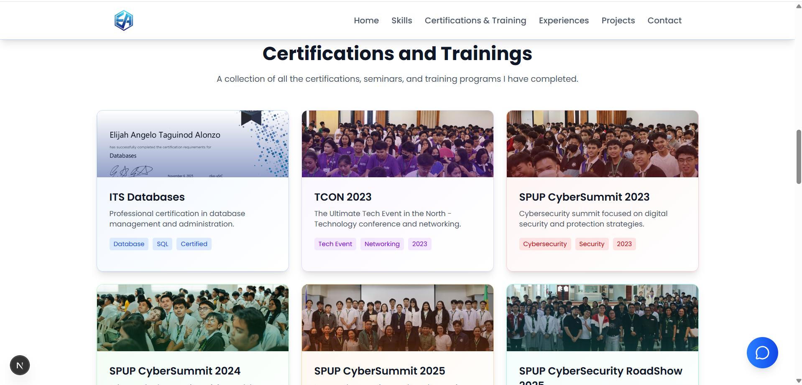
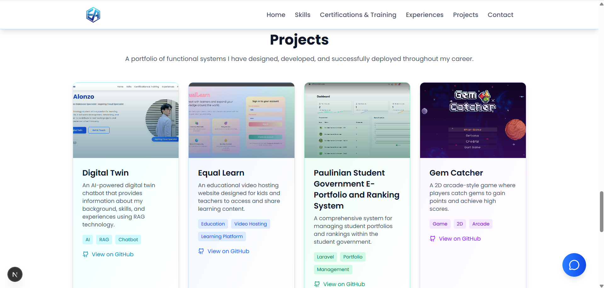
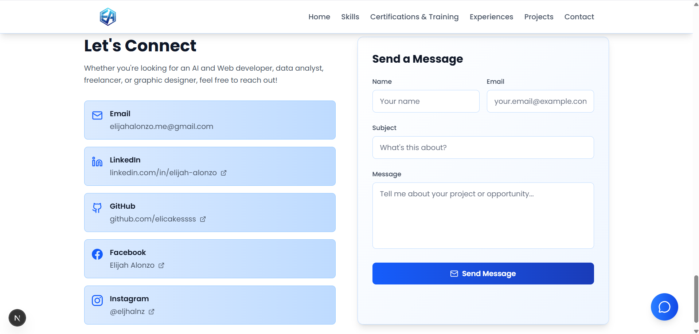
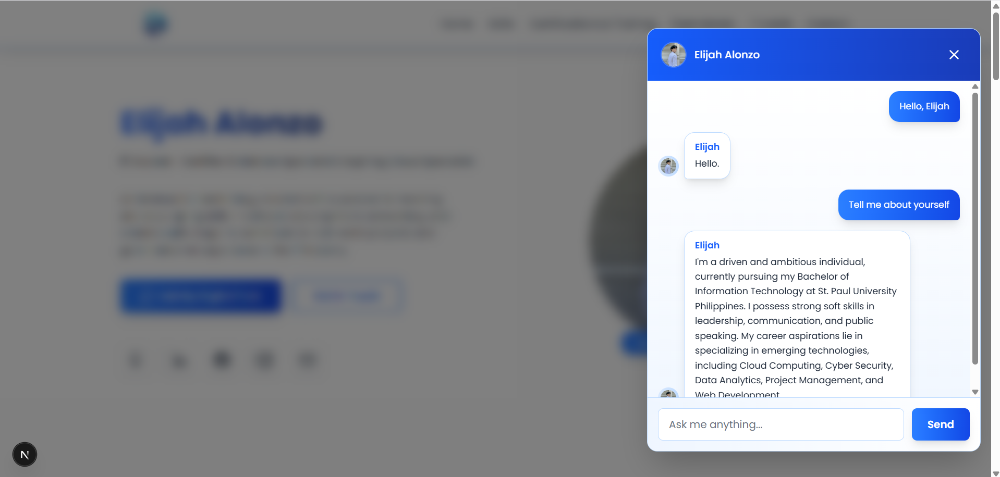

# E-Portfolio with RAG AI Chatbot

A personal portfolio website built with Next.js featuring a Retrieval-Augmented Generation (RAG) AI chatbot. Users can explore projects and ask questions to an AI assistant about the portfolio content in real time.

## Portfolio Sections

### Home

The landing page serves as the main entry point to your e-portfolio. It introduces visitors to who you are, what you do, and provides navigation to explore the rest of your portfolio. This section sets the tone for your professional brand and makes a strong first impression.

### Skills

Showcase your technical and professional competencies in this section. Highlight programming languages, frameworks, tools, and soft skills that are relevant to your career. Use clear categorization and proficiency levels to help visitors understand your expertise at a glance.

### Certifications & Training

Display any professional certifications, courses, or training programs you've completed. Include details such as the issuing organization, completion date, and relevant links or credentials. This section establishes credibility and demonstrates your commitment to continuous learning.

### Experience

Share your professional background and work history in this section. Include job titles, companies, employment periods, and key responsibilities or achievements. Provide context for how your experience has shaped your skills and professional development.

### Projects

Highlight your best work and completed projects. Include project descriptions, technologies used, links to live demos or repositories, and any key accomplishments or learnings. This section demonstrates your practical abilities and problem-solving skills.

### Contact

Provide visitors with multiple ways to get in touch. Include email, phone number, links to social media profiles, GitHub, LinkedIn, or other professional networks. Make it easy for potential employers, collaborators, or clients to reach you.

## AI Chatbot Feature

This portfolio includes an intelligent RAG (Retrieval-Augmented Generation) AI chatbot that allows visitors to ask questions about your portfolio content in real time. The chatbot retrieves relevant information from your portfolio sections and provides accurate, contextual responses to help visitors learn more about your work and expertise.

